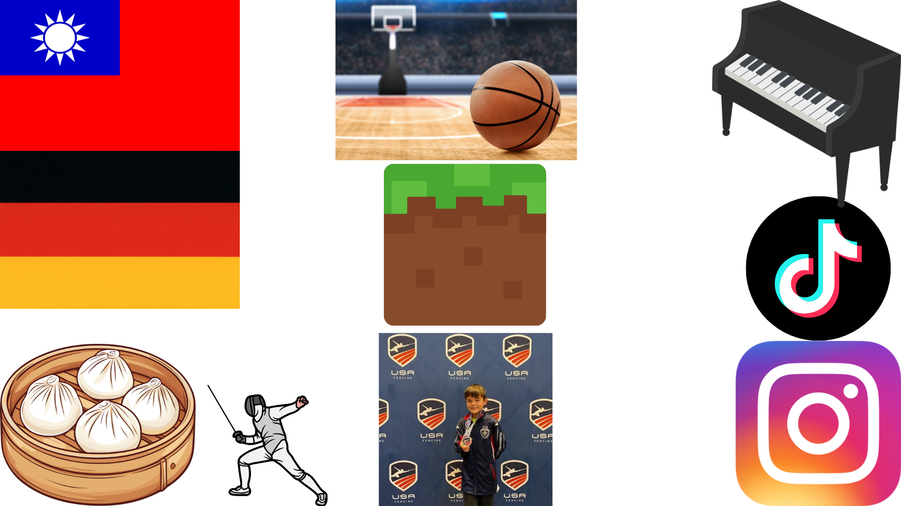

# me-in-markdown

[my Spotify Playlist](https://open.spotify.com/playlist/2OS8VGegyT0wdeNf2ZbXmT?si=4dBvJ1_wSt6lyfYjZiDIKA&utm_source=copy-link&pi=Y0VXZQMtRW6KT)

# Dear Mr. Aiello,
Hello! My name is Mason Bieler and I am in your tenth grade Computer Science A class. I am looking forward to working with you and learning Computer science to it's fullest. Some things you may need to know about me is that I have a 504 plan that makes me get 50% more testing, homework, and classwork time. I love computers and I play games like minecraft and Valorant recently.
Here are my goals for this year:
1. Acheive straight As
2. Get all 5s this year for the four classes I am taking
3. Understand computer science more
4. Beat Minecraft in under 30 minutes

I travelled to **China** this Summer. I was able to fence with international fencers and learn major points on how to be a better fencer throughout this summer. I can't wait to learn computer science this year and fufill all my goals while still having fun.

From, Mason Bieler
